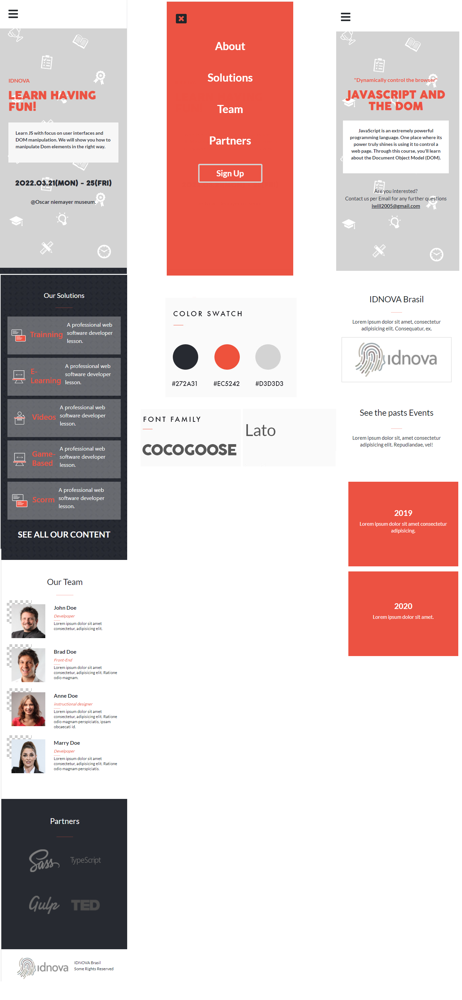

# Project Name

Microverse CAPSTONE I

Microverse CAPSTONE I (Mobile)

Additional description about the project and its features.

## Built With

- HTML
- CSS
- JS
- Bootstrap 5

## Live Demo

[Live Demo Link](https://iwillteixeira.github.io/microverse-capstone/index.html)

## Getting Started

**This is an example of how you may give instructions on setting up your project locally.**
**Modify this file to match your project, remove sections that don't apply. For example: delete the testing section if the currect project doesn't require testing.**

To get a local copy up and running follow these simple example steps.

git clone git@github.com:iwillteixeira/microverse-capstone.git

### Prerequisites

To contribute with this project you must instal the follow items:

*NODE
*NPM
*SASS
*GULP
### Setup

Dowload NPM and NODE
### Install

Install the packages globaly and after that
`<npm install>`

### Run tests

`npx hint .`
`npx stylelint "**/*.scss"`
`npx eslint .`
## Authors

👤 **Author1**

- GitHub: [@githubhandle](https://github.com/iwillteixeira)
- Twitter: [@twitterhandle](https://twitter.com/iwillteixeira)
- LinkedIn: [LinkedIn](https://www.linkedin.com/in/juscelino-t-39aa9049/)

## 🤝 Contributing

Contributions, issues, and feature requests are welcome!

Feel free to check the [issues page](../../issues/).

## Show your support

Give a ⭐️ if you like this project!

## Acknowledgments

[Microverse](https://www.microverse.com)
[FreeCodeCamp](https://www.freecodecamp.com)
- My Cat for stay calm and didn't walk above my keyboard
- My Wife for her support

## 📝 License

This project is [MIT](./MIT.md) licensed.